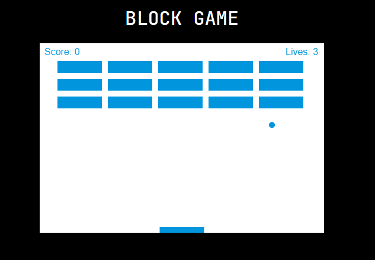

# 🎮 Block game
> 간단한 블록부시기 게임을 해보세요!

canvas를 이용해서 간단한 블록게임을 만들었습니다. 
### 보러가기: <https://camac0808.github.io/Block-game>

## 프로젝트에 사용된 언어 및 라이브러리

* Javascript ES6

## 프로젝트의 기능 설명

### 1. canvas를 이용하여 기본틀 제작

### 2. canvas틀을 기준으로 ball과 paddle을 그림

### 3. 충돌 감지를 표현하기 위해 ball이 paddle 범위 안으로 들어왔을때 진행방향과 속도를 변경

### 4. brick에 부딪힐때마다 brick의 랜덤 색깔 변화

## 정보

💌메일 – zqzwzazs@gmail.com - gomgom_@naver.com

## 기여 방법

1. (<https://github.com/camac0808/React-project/fork>)을 포크합니다.
2. (`git checkout -b feature/fooBar`) 명령어로 새 브랜치를 만드세요.
3. (`git commit -am 'Add some fooBar'`) 명령어로 커밋하세요.
4. (`git push origin feature/fooBar`) 명령어로 브랜치에 푸시하세요. 
5. 풀리퀘스트를 보내주세요.

<!-- Markdown link & img dfn's -->
[npm-image]: https://img.shields.io/npm/v/datadog-metrics.svg?style=flat-square
[npm-url]: https://npmjs.org/package/datadog-metrics
[npm-downloads]: https://img.shields.io/npm/dm/datadog-metrics.svg?style=flat-square
[travis-image]: https://img.shields.io/travis/dbader/node-datadog-metrics/master.svg?style=flat-square
[travis-url]: https://travis-ci.org/dbader/node-datadog-metrics
[wiki]: https://github.com/yourname/yourproject/wiki
